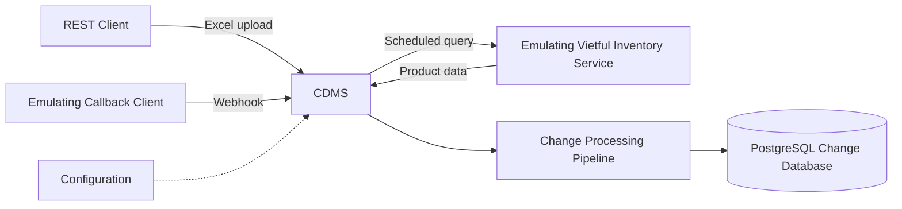
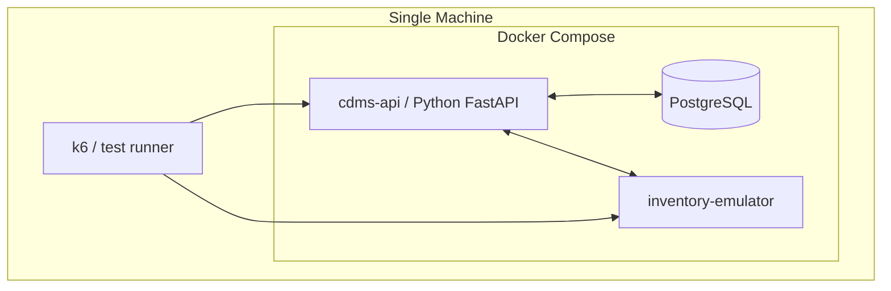
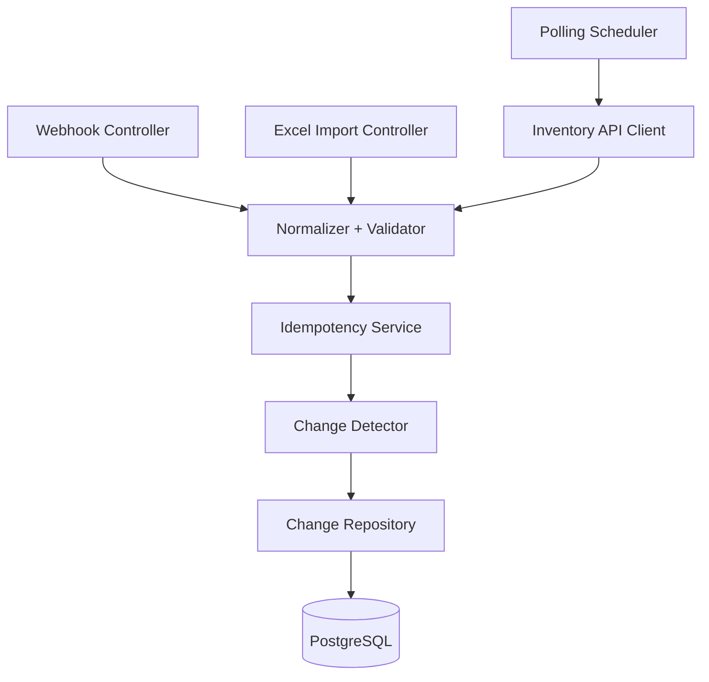
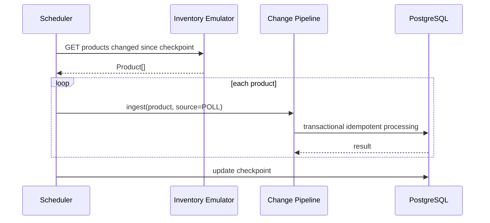
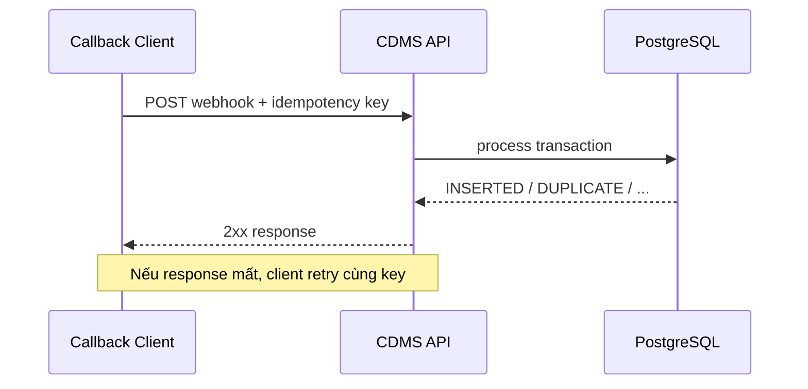
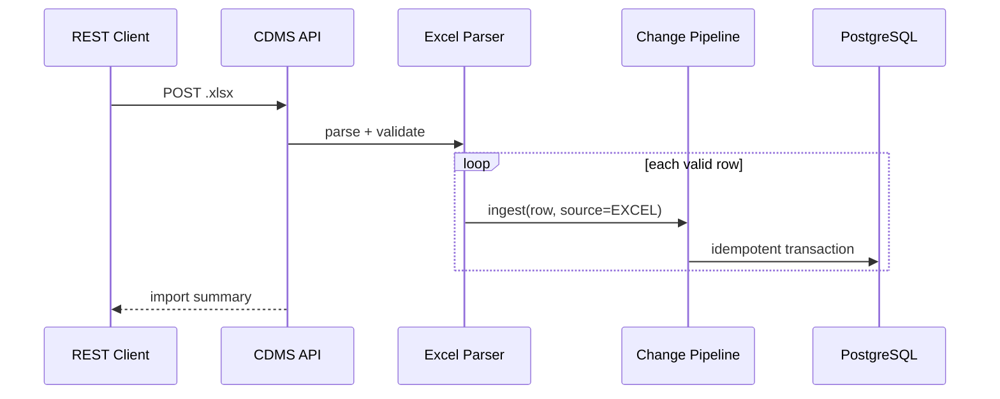

# ARCHITECTURE.md — CDMS System Architecture

> Tài liệu này mô tả kiến trúc bám theo sơ đồ trong đề bài.  
> Phần `[ĐỀ XUẤT]` là lựa chọn kỹ thuật để biến yêu cầu thành prototype có thể chạy/test được.

---

## 1. Architectural goals

Kiến trúc cần ưu tiên:

1. **Exactly-once effect** tại database.
2. Ba nguồn ingestion dùng chung một processing pipeline.
3. Có thể phục hồi sau lỗi/restart.
4. Dễ chứng minh bằng integration/load test.
5. Chạy được trên một máy.
6. Đơn giản đủ cho bài test nhưng không đánh đổi correctness.

---

## 2. High-level architecture



Ba đường dữ liệu đều hội tụ vào **Change Processing Pipeline**. Đây là điểm quan trọng để logic dedup/exactly-once không bị triển khai ba lần theo ba kiểu khác nhau.

---

## 3. Deployment view [ĐỀ XUẤT]



### Container đề xuất

- `cdms`
- `inventory-emulator`
- `postgres`

Callback client và k6 có thể:
- chạy như CLI/test process trên host, hoặc
- thêm container riêng khi demo.

---

## 4. CDMS internal architecture [ĐỀ XUẤT]



### Modules

#### 4.1 API Layer

Trách nhiệm:

- nhận HTTP request,
- validate format cơ bản,
- tạo `requestId`,
- trả status/response.

Không chứa logic dedup/exactly-once.

---

#### 4.2 Polling Scheduler

Trách nhiệm:

- chạy theo interval cấu hình,
- query Inventory Emulator,
- chuyển từng Product vào processing pipeline,
- lưu checkpoint/cursor nếu cần.

---

#### 4.3 Inventory API Client

Trách nhiệm:

- HTTP call tới Inventory Emulator,
- timeout,
- retry/backoff,
- pagination/cursor nếu có.

---

#### 4.4 Excel Importer

Trách nhiệm:

- parse `.xlsx`,
- validate header,
- map row → Product DTO,
- không tự ghi DB change,
- gửi DTO vào pipeline chung.

---

#### 4.5 Normalizer + Validator

Mục tiêu: cùng một Product từ webhook/polling/excel phải tạo cùng canonical representation.

Ví dụ:

- trim string,
- chuẩn hóa number,
- chuẩn hóa ISO datetime,
- sort key khi hash JSON.

Output:

```ts
NormalizedProductChange
```

---

#### 4.6 Idempotency Service

Mục tiêu: nhận biết event/request đã được xử lý hay chưa.

Database phải là authority.

Không dùng cách:

```ts
if (memorySet.has(eventId)) ...
```

vì sẽ mất state khi restart và không an toàn khi concurrent.

---

#### 4.7 Change Detector

Mục tiêu:

- tìm trạng thái mới nhất của product,
- so sánh `updatedAt/version`,
- so sánh canonical hash,
- quyết định:
  - `INSERTED`
  - `NO_CHANGE`
  - `STALE`
  - `DUPLICATE_EVENT`

---

#### 4.8 Change Repository

Chịu trách nhiệm transaction và constraint.

Exactly-once correctness nằm chủ yếu ở đây.

---

## 5. PostgreSQL architecture [ĐỀ XUẤT]

### 5.1 `ingestion_events`

Dùng làm idempotency inbox.

```text
id
idempotency_key UNIQUE
source
payload_hash
status
created_at
processed_at
error_message
```

### 5.2 `product_changes`

Append-only change store.

```text
id
product_id
source
source_updated_at
payload JSONB
payload_hash
created_at
```

Constraint đề xuất:

```sql
UNIQUE (product_id, payload_hash)
```

Có thể thêm:

```sql
INDEX (product_id, source_updated_at DESC)
```

### 5.3 `polling_checkpoints`

```text
source
cursor / last_updated_at
updated_at
```

---

## 6. Exactly-once strategy [ĐỀ XUẤT]

Không cố đảm bảo mạng "gửi đúng một lần" — điều đó không thực tế khi timeout/retry.

Mục tiêu là:

> **At-least-once delivery + idempotent transactional processing = exactly-once database effect.**

Flow:

```text
BEGIN
  1. Insert ingestion_event(idempotency_key)
     ON CONFLICT -> DUPLICATE_EVENT

  2. Lock logical product
     - SELECT ... FOR UPDATE
     hoặc pg_advisory_xact_lock(...)

  3. Load latest accepted change

  4. Reject stale/no-change

  5. INSERT product_changes
     protected by UNIQUE constraint

  6. Mark ingestion_event = PROCESSED
COMMIT
```

### Failure case quan trọng

#### Case A — crash trước COMMIT

Transaction rollback → retry xử lý lại được.

#### Case B — COMMIT thành công nhưng HTTP response bị mất

Client retry → `idempotency_key` đã tồn tại → không insert lần hai.

Đây là scenario cần demo để chứng minh exactly-once.

---

## 7. Concurrency control [ĐỀ XUẤT]

Nếu webhook và polling cùng xử lý Product `P-1`:

```text
Webhook ----\
             > same per-product lock -> serialized decision
Polling ----/
```

Các product khác nhau vẫn được xử lý song song.

Lựa chọn nhẹ:

```sql
SELECT pg_advisory_xact_lock(hashtext(product_id));
```

Hoặc duy trì bảng `product_heads` để row-lock rõ ràng hơn.

---

## 8. Data flow

### 8.1 Scheduled polling



---

### 8.2 Webhook



---

### 8.3 Excel upload



---

## 9. Failure boundaries [ĐỀ XUẤT]

| Failure | Expected behavior |
|---|---|
| CDMS crash | Restart, retry event safely |
| PostgreSQL unavailable | Request fails/retries, no partial commit |
| Inventory unavailable | Poll retries later |
| Callback sender retry | Same event produces one DB effect |
| Excel upload repeated | Same logical changes not duplicated |
| Concurrent sources | Per-product serialization prevents race |

---

## 10. Technology selection [ĐÃ TRIỂN KHAI]

### Runtime

- Python 3.13
- FastAPI (High-performance Async Web Framework)
- Uvicorn (ASGI Server)

### Database

- PostgreSQL 16
- `asyncpg` (Asynchronous PostgreSQL client) kết hợp raw SQL transaction minh bạch, kiểm soát locking cấp độ transaction.
- `MemoryDatabaseClient` tích hợp sẵn phục vụ chạy unit/integration test không phụ thuộc infrastructure ngoài.

### Supporting libraries

- `pydantic` v2 — schema validation & data contracts
- `openpyxl` — Excel `.xlsx` stream import
- `faker` — inventory seed & test data generation
- `httpx` — asynchronous HTTP client cho Polling & Webhook
- `pytest` & `pytest-asyncio` — automated test runner
- `k6` — spike/load test

### Deployment

- Docker
- Docker Compose

---

## 11. Architecture decisions

### ADR-001 — Một processing pipeline

**Decision:** cả 3 ingestion mechanism dùng chung `ChangeProcessor`.

**Reason:** tránh 3 bộ logic duplicate/exactly-once khác nhau.

---

### ADR-002 — PostgreSQL là idempotency authority

**Decision:** unique constraints + transaction là lớp bảo vệ cuối cùng.

**Reason:** application check riêng lẻ vẫn có race condition.

---

### ADR-003 — Không thêm message broker ở prototype

**Decision:** không dùng Kafka/RabbitMQ trong phiên bản tối thiểu.

**Reason:** đề bài yêu cầu prototype single-machine; PostgreSQL đã đủ để chứng minh correctness. Broker có thể là extension.

---

### ADR-004 — Append-only change store

**Decision:** `product_changes` không update record cũ.

**Reason:** phù hợp mục tiêu "store changes"; dễ audit và demo.

---

## 12. Extension points

Sau prototype có thể mở rộng:

- Outbox pattern.
- Worker queue.
- Kafka.
- Multi-instance CDMS.
- Object storage cho file import.
- Prometheus/Grafana.
- Authentication/authorization.
