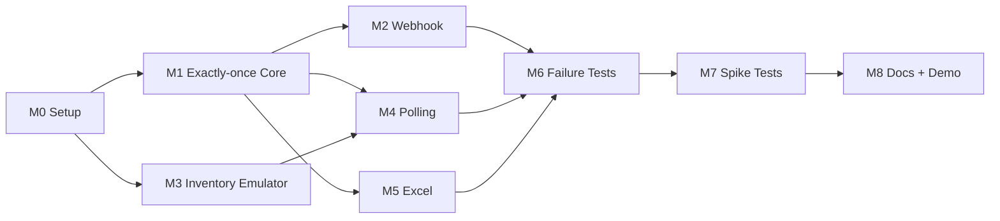

# PLAN.md — CDMS Implementation Plan

> Kế hoạch này chuyển yêu cầu bài test thành các milestone nhỏ, ưu tiên correctness trước UI/performance.  
> Thời lượng là **ước lượng đề xuất**, có thể co giãn theo deadline thực tế.

---

## 1. Delivery strategy

Thứ tự ưu tiên:

```text
Specification
  -> runnable skeleton
  -> database correctness
  -> one ingestion path
  -> shared pipeline
  -> remaining ingestion paths
  -> failure tests
  -> spike tests
  -> documentation/demo
```

Không nên làm cả 3 ingestion source trước khi exactly-once core đã ổn.

---

## 2. Milestones

### M0 — Project setup

**Goal:** repository chạy được bằng Docker Compose.

Tasks:

- [ ] Init Git repository.
- [x] Init Python FastAPI workspace (PEP 8, Pydantic v2).
- [ ] Tạo `cdms` service.
- [ ] Tạo `inventory-emulator`.
- [ ] Tạo PostgreSQL container.
- [ ] Tạo `.env.example`.
- [ ] Thêm `/health`.
- [ ] Thêm migration runner.
- [ ] `docker compose up --build` chạy thành công.

**Exit criteria:**

```text
CDMS healthy
Inventory emulator healthy
PostgreSQL reachable
```

---

### M1 — Database + exactly-once core

**Goal:** xây core trước khi làm source-specific logic.

Tasks:

- [ ] Tạo `ingestion_events`.
- [ ] Tạo `product_changes`.
- [ ] Tạo indexes/unique constraints.
- [ ] Implement canonicalizer.
- [ ] Implement payload hash.
- [ ] Implement idempotency key.
- [ ] Implement transaction.
- [ ] Implement per-product advisory lock.
- [ ] Implement `ChangeProcessor`.
- [ ] Unit test change decision.
- [ ] Integration test duplicate/concurrency.

**Exit criteria:**

- [ ] Same event gửi nhiều lần → 1 DB effect.
- [ ] Same payload khác event → không tạo duplicate product state.
- [ ] Stale change bị reject.
- [ ] Concurrent same-product request không tạo duplicate.

---

### M2 — Webhook ingestion

**Goal:** có end-to-end flow nhỏ nhất.

Tasks:

- [ ] `POST /api/v1/webhooks/products`.
- [ ] Zod schema validation.
- [ ] `Idempotency-Key`.
- [ ] Structured logging.
- [ ] API integration tests.
- [ ] Lost-response retry scenario.

**Demo checkpoint:**

```text
curl webhook
-> INSERTED
retry same request
-> DUPLICATE_EVENT
DB
-> 1 product change
```

---

### M3 — Inventory Emulator

**Goal:** có nguồn dữ liệu để scheduled polling hoạt động.

Tasks:

- [ ] Product model.
- [ ] Faker seed.
- [ ] GET products.
- [ ] GET product by ID.
- [ ] POST/PATCH product để demo change.
- [ ] Hỗ trợ filter `updatedSince` hoặc cursor [nếu tự thiết kế].
- [ ] Add latency/error injection switch [optional nhưng rất hữu ích].

**Exit criteria:**

- [ ] Có thể tạo product mới.
- [ ] Có thể sửa product.
- [ ] CDMS có thể query product thay đổi.

---

### M4 — Scheduled polling

**Goal:** ingestion source thứ hai dùng chung `ChangeProcessor`.

Tasks:

- [ ] Inventory HTTP client.
- [ ] Timeout.
- [ ] Retry/backoff.
- [ ] Polling scheduler.
- [ ] Checkpoint table.
- [ ] Process batch.
- [ ] Restart/retry integration test.
- [ ] Inventory-down failure test.

**Exit criteria:**

- [ ] Poll lấy product mới.
- [ ] Poll lặp lại không duplicate.
- [ ] Restart CDMS không phá exactly-once.

---

### M5 — Excel ingestion

**Goal:** ingestion source thứ ba.

Tasks:

- [ ] Multipart upload endpoint.
- [ ] `.xlsx` parsing.
- [ ] Header validation.
- [ ] Row validation.
- [ ] File hash.
- [ ] Controlled concurrency.
- [ ] Import summary response.
- [ ] Re-upload same file test.
- [ ] File chứa duplicate rows test.

**Exit criteria:**

- [ ] Excel valid được ingest.
- [ ] Row invalid được report.
- [ ] Upload lại không tạo duplicate.

---

### M6 — Failure handling

**Goal:** chứng minh correctness khi dependency/process lỗi.

Tasks:

- [ ] DB unavailable test.
- [ ] CDMS crash before commit.
- [ ] Simulate response lost after commit.
- [ ] Inventory unavailable.
- [ ] Callback retry.
- [ ] Docker restart test.
- [ ] Verify PostgreSQL volume persistence.

**Deliverable:**

```text
tests/failure/
FAILURE_TEST_REPORT.md
```

---

### M7 — Spike + concurrent load

**Goal:** đáp ứng phần spike load của assignment.

Tasks:

- [ ] Viết k6 script.
- [ ] Webhook spike scenario.
- [ ] Mix webhook + polling + Excel.
- [ ] Capture latency/error rate.
- [ ] Query DB after test.
- [ ] Verify duplicate = 0.
- [ ] Ghi cấu hình máy chạy test.

**Deliverable:**

```text
tests/load/
LOAD_TEST_REPORT.md
```

---

### M8 — Documentation + demo

**Goal:** đủ tài liệu để review nhanh.

Tasks:

- [ ] Finalize README.
- [ ] Finalize SPEC.
- [ ] Finalize ARCHITECTURE.
- [ ] Finalize DESIGN.
- [ ] Finalize PLAN.
- [ ] Add API examples.
- [ ] Add ERD/sequence diagrams.
- [ ] Add test commands.
- [ ] Add known limitations.
- [ ] Add implemented/not implemented table.
- [ ] Add AI usage disclosure.
- [ ] Add lessons learned.
- [ ] Chuẩn bị demo script.

---

## 3. Suggested execution order by day

### Day 1

- M0.
- Database schema.
- Core processing skeleton.

### Day 2

- Finish M1.
- Webhook end-to-end.

### Day 3

- Inventory Emulator.
- Scheduled polling.

### Day 4

- Excel import.
- Integration tests.

### Day 5

- Failure injection.
- Concurrency test.

### Day 6

- Spike test.
- Bug fixing.
- Logs/health/readiness.

### Day 7

- Documentation.
- Demo rehearsal.
- Cleanup repository.

> Nếu deadline ngắn hơn, ưu tiên M0 → M1 → M2 → M3/M4 → M5 → M6 → docs; spike test tối thiểu vẫn phải có vì được nêu trực tiếp trong đề.

---

## 4. Task dependency graph



---

## 5. Test checklist

### Unit

- [ ] Product schema validation.
- [ ] Canonical JSON.
- [ ] Hash stability.
- [ ] Stale comparison.
- [ ] No-change comparison.

### Integration

- [ ] Webhook insert.
- [ ] Webhook duplicate.
- [ ] Concurrent duplicate.
- [ ] Poll insert.
- [ ] Poll overlap.
- [ ] Excel insert.
- [ ] Excel duplicate.
- [ ] Same product from 3 sources.

### Failure

- [ ] DB down.
- [ ] Inventory down.
- [ ] CDMS restart.
- [ ] Crash before commit.
- [ ] Commit then lost response.

### Load

- [ ] Spike.
- [ ] Concurrent sources.
- [ ] DB duplicate count = 0.

---

## 6. Definition of Done per feature

Mỗi feature chỉ chuyển sang `DONE` khi:

- [ ] Code chạy.
- [ ] Test pass.
- [ ] Error path đã nghĩ tới.
- [ ] Log có trace context.
- [ ] Không phá exactly-once.
- [ ] README/API docs cập nhật.
- [ ] Có thể demo bằng command rõ ràng.

---

## 7. Demo script

### Step 1 — Start

```bash
docker compose up --build
```

### Step 2 — Webhook exactly-once

```text
send event A
send event A again
show only one DB change
```

### Step 3 — Polling

```text
create/update product in emulator
wait/run poll
show new change
run poll again
show no duplicate
```

### Step 4 — Excel

```text
upload products.xlsx
upload same file again
show summary + no duplicate
```

### Step 5 — Failure

```text
commit event but simulate lost response
retry same event
show exactly one DB effect
```

### Step 6 — Spike

```text
run k6
show metrics
query DB duplicate check
```

---

## 8. Final presentation outline

```text
1. Problem
2. Requirements
3. Architecture
4. Exactly-once design
5. Three ingestion mechanisms
6. Failure handling
7. Test evidence
8. Spike test result
9. Implemented vs not implemented
10. AI usage
11. Lessons learned
```

---

## 9. Risk register

| Risk | Mitigation |
|---|---|
| Race condition | DB constraint + per-product lock |
| Duplicate retry | Idempotency inbox |
| Lost HTTP response | Retry same idempotency key |
| Stale updates | compare source timestamp/version |
| Poll overlap | intentional overlap + idempotency |
| Huge Excel file | size limit + controlled concurrency |
| DB outage | transaction + retryable error |
| Too much scope | no UI/message broker in MVP |
| Performance claims thiếu căn cứ | report actual test machine + measurements |

---

## 10. Candidate delivery checklist

- [ ] Git history sạch, commit có ý nghĩa.
- [ ] Không commit `.env`.
- [ ] Có `.env.example`.
- [ ] One-command startup.
- [ ] One-command test.
- [ ] One-command load test.
- [ ] Markdown docs đầy đủ.
- [ ] Implemented/not implemented rõ ràng.
- [ ] AI usage minh bạch.
- [ ] Lessons learned.
